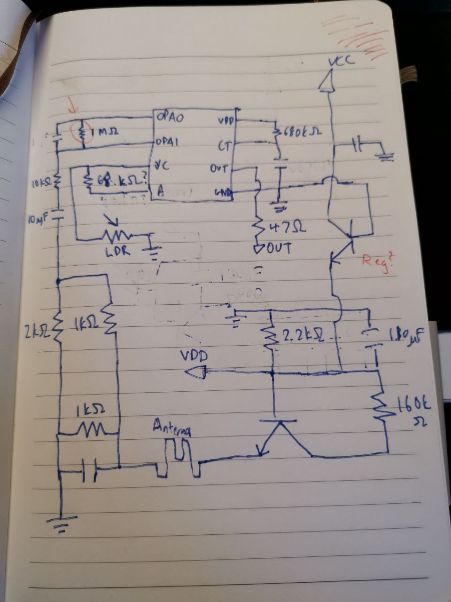
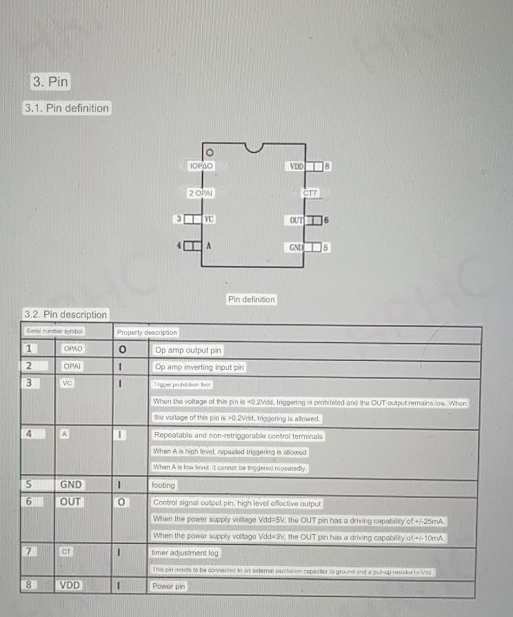

I managed to lower the range down to 2.0m +- 0.2m by modifying the 1Mohm across the Opamp to 145kOhm. I don't have any idea how the relationship of range and resistor value scales in this circuit so I just tried a bunch of different values until I got it right. I think it works similarly to the RCWL-0516's R-GN resistor.

Update:
Disconnecting pin4 from the pcb and connecting it via 10K ohm to pin 8 makes it retriggerable
I have the impression that this works so much better... no need to change the RC timing.
I see that pin 4 is also connected to the LDR, so I'm not sure if this modification is going to mess with the light sensitivity
I'll do some field testing later

Update:
the modified lamp has now been working for a couple of weeks.
It is in a dark room and has to light up multiple times per day.
It nicely re-triggers, as long as it sees movement, and the light has regularly been "on" continuously for 15 min without me having to wave my arms or anything.
So far, no negative effects on this hack
